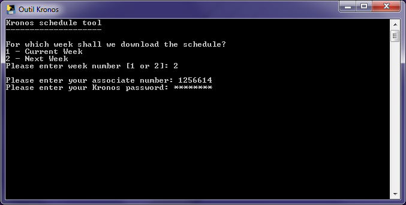
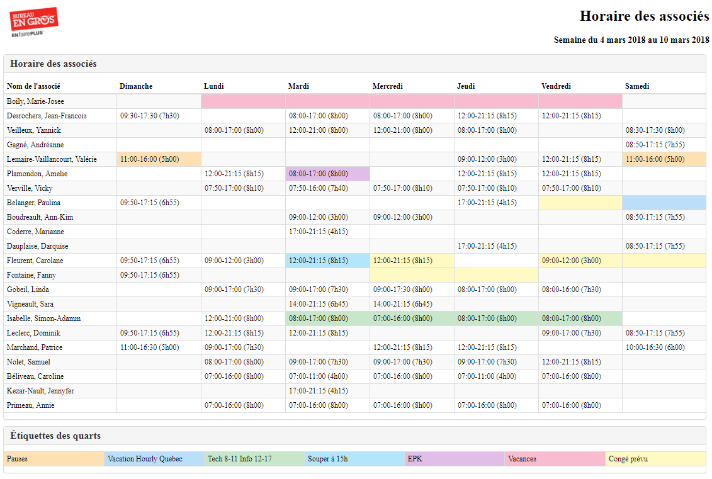

# KronosTool

## Usage

Ouvrez le programme, choisissez la semaine pour laquelle imprimer l'horaire (1- semaine en cours, 2- semaine suivante) et appuyez sur `enter`. Entrez votre nom d'utilisateur Kronos (votre numéro d'associé) et appuyez sur `enter`. Entrez votre mot de passe Kronos et appuyez sur `enter`.

Le programme récupère l'horaire et l'ouvre dans un navigateur web à partir duquel vous pouvez le sauvegarder ou l'imprimer.

*Note*: Puisque mon programme utilise le même mécanisme que l'application mobile, il se peut que vous deviez recommencer à quelques reprises avant d'obtenir l'horaire à cause d'erreurs de serveur (le programme essaie automatiquement 5 fois avant d'abandonner).